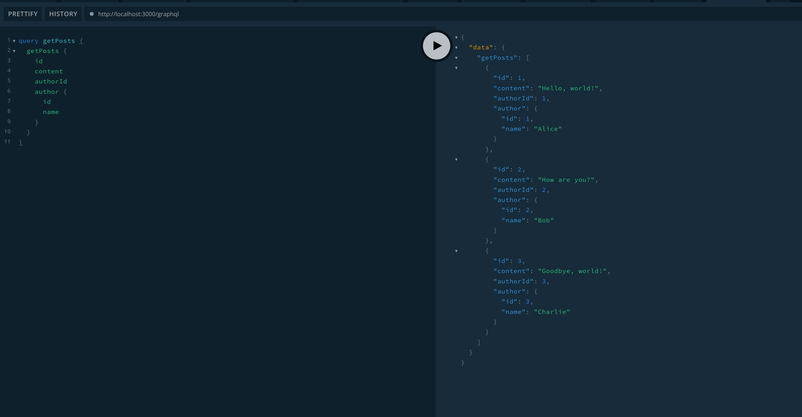

# 概要
GraphQLで発生するN+1問題を、DataLoaderを使って解消を試みる
UserとPostが1対Nの関係にあり、Userが紐付いたPost一覧を取得する。
本来であれば、Post 1件ごとにUser取得してN+1が発生するが、DataLoaderを使うとUserの取得を一回のクエリで済ますことができる。



# 確認手順
`npm run start:dev`でサーバを立ち上げる


`http://localhost:3000/graphql`にアクセス

authorが紐付いたpost一覧を取得.

```graphql
query getPosts {
	getPosts {
    id
    content
    authorId
    author {
      id
      name
    }
  }
}
```

batchGetUsersが一度しか呼ばれないことを確認
N+1解消
